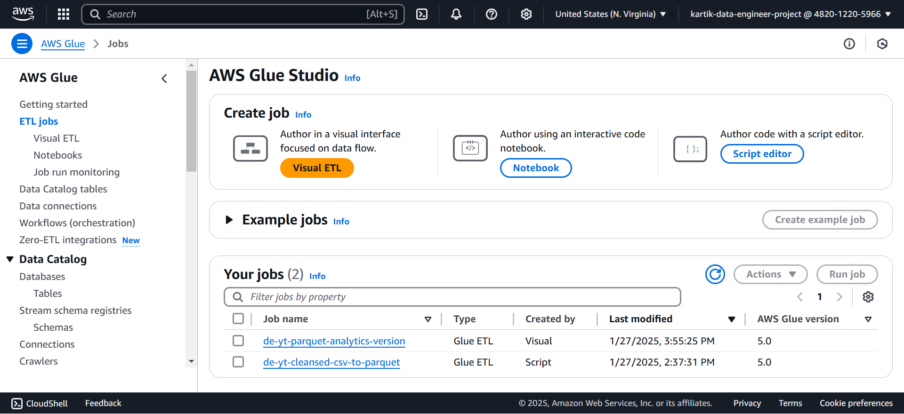

# YouTube-Analysis-using-AWS

## Overview
This project aimed to analyze the structured and semi-structured YouTube video data based on the video categories and trending metrics using AWS services.

## AWS Services used
1. Amazon S3: Used to store raw data, clean/processed data, and analytics data.
2. AWS IAM: Used to securely manage access to AWS services and resources.
3. QuickSight: For building dashboards from the analytics data.
4. AWS Glue: Built ELT pipelines to process raw data for analysis.
5. AWS Lambda: Virtual function, used to format data in the desired format while storing raw data in an S3 bucket.
6. AWS Athena: Athena is used to query data directly from S3 and act as a quicksight source.

## Architecture Diagram

## S3 Buckets

1. Raw Bucket: Used to store raw data from the source.
2. Cleasned Bucket: Used to store processed data.
3. Analytics Bucket: used to store analytics data.

## Lambda Function
- This function is used to format data from raw bucket and store it in a cleansed data bucket in parquet format.

## AWS Glue
- It runs the ETL job on the cleansed bucket and stores the transformed data in the analytics data bucket.

## Glue Database

## Athena

## QuickSight Dashboard

## QuickSight Database Source

